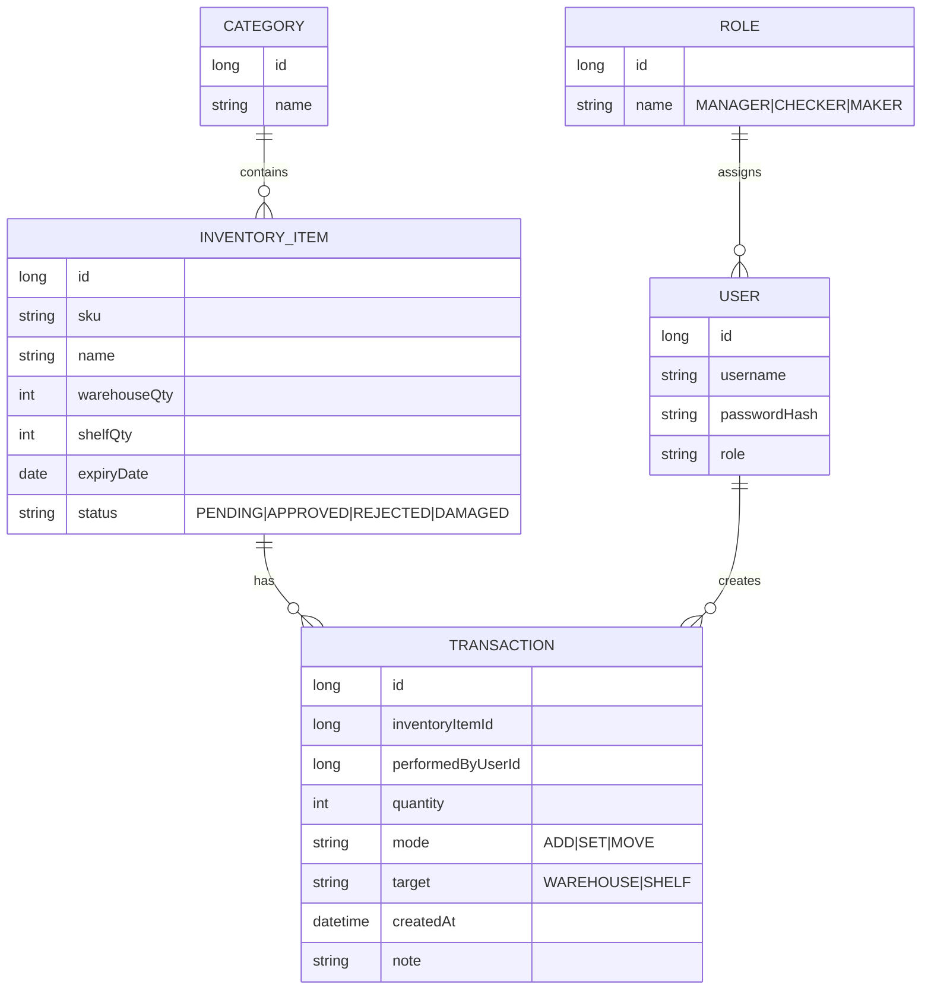

# Inventory Management System (React + Spring Boot)

[](https://adoptium.net)
[](https://spring.io/projects/spring-boot)
[](https://reactjs.org)
[](https://www.mysql.com)
[](https://maven.apache.org)
[](./LICENSE)

## Project Overview
A full-stack Inventory Management System that enables teams to track products, manage stock across warehouse and shelf, and enforce maker-checker-manager approvals. It provides live analytics (expired, low stock, damaged), stock movement, and reporting.

Key features:
- Role-based access: Manager, Maker, Checker
- Inventory CRUD with maker submission and checker approval workflow
- Warehouse ↔ Shelf stock updates with add/set modes
- Live analytics dashboard (totals, health, trends) with periodic refresh
- Alerts for low, expiring, and damaged items
- Reporting endpoints for summaries, movements, and invoices

## Tech Stack
- Frontend: React, Axios, Recharts (or Chart.js), Tailwind CSS
- Backend: Spring Boot, Spring Security (JWT), JPA/Hibernate, MySQL
- Tooling: Maven, IntelliJ IDEA, VS Code

## System Architecture
Architecture diagram (frontend → backend → DB, layered backend with security and schedulers):


- The React client calls REST APIs via Axios using a base URL (e.g., `http://localhost:8080`).
- Backend follows Controller → Service → Repository → Database layering.
- JWT-based auth secures endpoints; roles are validated per route.
- Scheduled tasks and client polling provide near real-time updates and alerts.

## Workflow Description
- Maker: Submits new or updated inventory items (SKU, category, quantity, expiry, status).
- Checker: Reviews pending items, approves or rejects submissions.
- Manager: Oversees system analytics, moves stock between warehouse and shelf, and resolves alerts.
- Stock movement:
  - Add mode: increment quantities.
  - Set mode: override quantities.
- Live updates:
  - UI periodically refreshes summaries and stats (e.g., every 30s).
  - Alerts surface low stock, near expiry, and damaged inventory.

## Routing & Role Access
Frontend routes:
- `/login`, `/signup`
- `/managerdashboard`, `/checkerdashboard`, `/makerdashboard`
- `/invoices`, `/inventory`

Role-based access:
- Public: `/login`, `/signup`
- Authenticated: all other routes
- Redirect after login by role:
  - Manager → `/managerdashboard`
  - Checker → `/checkerdashboard`
  - Maker → `/makerdashboard`

Protected route example (React Router + role guard):
- This guard redirects unauthenticated users to `/login` and blocks users without the required role.

```javascript
// Protects routes by auth and role
import { Navigate, Outlet } from 'react-router-dom';

export function ProtectedRoute({ allowedRoles }) {
  const token = localStorage.getItem('ims_token');
  const user = token ? JSON.parse(atob(token.split('.')[1])) : null; // decode JWT payload
  const role = user?.role;

  if (!token) return <Navigate to="/login" replace />;

  if (allowedRoles && !allowedRoles.includes(role)) {
    const byRole = {
      MANAGER: '/managerdashboard',
      CHECKER: '/checkerdashboard',
      MAKER: '/makerdashboard',
    };
    return <Navigate to={byRole[role] || '/login'} replace />;
  }
  return <Outlet />;
}
```

## API Endpoints (Backend)
Major REST endpoints:
- Auth
  - `POST /api/auth/signup`
  - `POST /api/auth/login`
  - `GET /api/auth/me`
- Inventory
  - `GET /api/inventory/all`
  - `GET /api/inventory/expired`
  - `GET /api/inventory/low-stock`
  - `GET /api/inventory/damaged`
  - `GET /api/inventory/stats`
  - `GET /api/inventory/categories`
  - `GET /api/inventory/items?category={name}`
  - `POST /api/inventory`
  - `PUT /api/inventory/update/{id}`
  - `DELETE /api/inventory/{id}`
  - `GET /api/inventory/recent`
- Stock
  - `GET /api/stock/summary`
  - `POST /api/stock/warehouse` \(`add` or `set` mode\)
  - `POST /api/stock/shelf` \(`add` or `set` mode\)
- Reports
  - `GET /api/reports/stock-movements`
  - `GET /api/reports/invoices`
  - `GET /api/reports/export?type=csv`

Example requests:
- Auth and inventory examples.

```http
POST /api/auth/login
Content-Type: application/json

{
  "username": "maker1",
  "password": "secret"
}

###
GET /api/stock/summary
Authorization: Bearer <JWT>

###
PUT /api/inventory/update/42
Authorization: Bearer <JWT>
Content-Type: application/json

{
  "name": "Milk 1L",
  "warehouseQty": 120,
  "shelfQty": 40,
  "expiryDate": "2025-12-31",
  "status": "APPROVED"
}
```

## Database Schema
Entities and relationships:
- User \(`User`\) \↔ Role \(`Role`\): Many-to-One (each user has one role)
- Category \(`Category`\) \↔ InventoryItem \(`Inventory`\): One-to-Many
- InventoryItem \↔ Transaction \(`Transactions`\): One-to-Many (movement, approval logs)
- User \↔ Transaction: One-to-Many (who performed it)

ER diagram:



## Setup Instructions
Prerequisites:
- Java 17+, Maven 3.9+
- Node.js 18+ and npm
- MySQL 8+
- IntelliJ IDEA or VS Code

1\) Clone the repository.

```bash
git clone https://github.com/<your-org>/<your-repo>.git
cd <your-repo>
```

2\) Database setup (create schema and user).

```sql
CREATE DATABASE inventory_db CHARACTER SET utf8mb4 COLLATE utf8mb4_unicode_ci;
CREATE USER 'ims_user'@'localhost' IDENTIFIED BY 'strong_password';
GRANT ALL PRIVILEGES ON inventory_db.* TO 'ims_user'@'localhost';
FLUSH PRIVILEGES;
```

3\) Backend configuration \(`src/main/resources/application.properties`\).
- JDBC, JPA, and JWT/CORS settings.

```properties
# MySQL
spring.datasource.url=jdbc:mysql://localhost:3306/inventory_db?useSSL=false&allowPublicKeyRetrieval=true&serverTimezone=UTC
spring.datasource.username=ims_user
spring.datasource.password=strong_password

# JPA
spring.jpa.hibernate.ddl-auto=update
spring.jpa.show-sql=true

# Web
server.port=8080
spring.security.cors.allowed-origins=http://localhost:5173,http://localhost:3000

# Security
app.jwt.secret=change-me-please
app.jwt.expiration=86400000
```

4\) Run backend (from `backend/` or project root if single-module).
- Builds and starts Spring Boot on port `8080`.

```bash
mvn clean install
mvn spring-boot:run
#For windows :  cd Backend ,cd store 
.\mvnw.cmd spring-boot:run
```

5\) Frontend configuration \(`frontend/.env`\).
- Set the API base URL and token key.

```bash
VITE_API_BASE_URL=http://localhost:8080
VITE_AUTH_TOKEN_KEY=ims_token
```

6\) Run frontend (from `frontend/`).
- Starts the dev server on port `5173` \(`npm start` for CRA on `3000`\).

```bash
npm install
npm run dev
```

7\) Sign in and test
- Open `http://localhost:5173` (or `http://localhost:3000`).
- Create users via `POST /api/auth/signup` or seed data.
- Verify role-based redirects and protected routes.

Notes:
- Ensure CORS is enabled for the frontend origin.
- On Windows, run commands in PowerShell or Git Bash; services run on the same ports.

## Future Enhancements
- Export analytics and reports to CSV/XLSX/PDF
- Barcode/QR scanning for fast item lookup and movement
- Supplier and purchase order modules
- WebSockets for push notifications and live updates
- Audit trail with diff views and reason codes

## Contributors / License
- Contributors: PRs welcome. Create feature branches and open pull requests with concise descriptions.
- License: Open-source under MIT. See `LICENSE`.